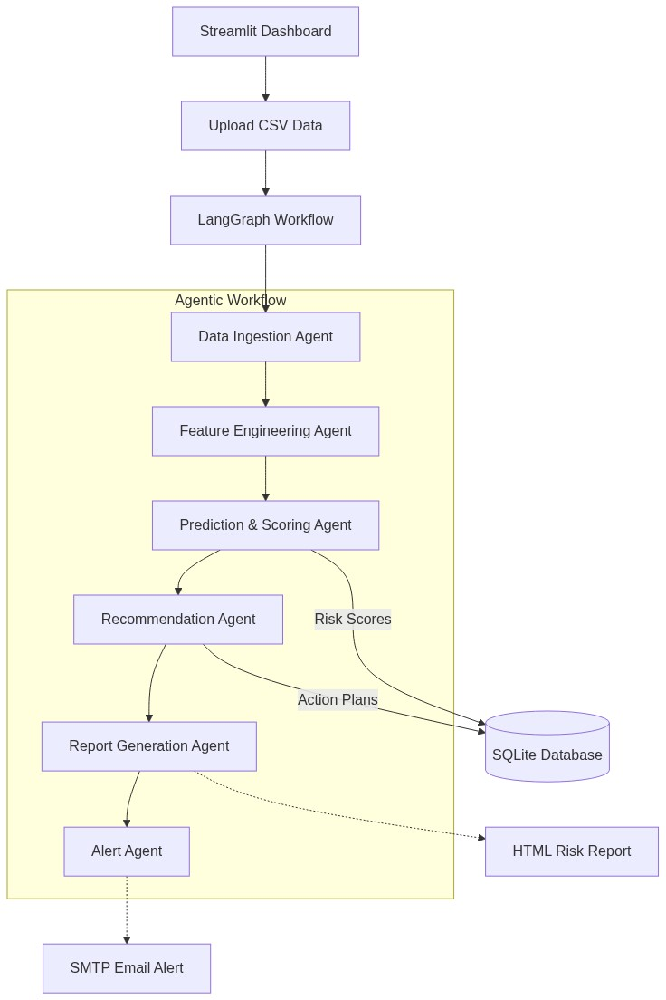

# AttritionIQ

## Problem Statement
High employee turnover is a costly problem for organizations. Traditional HR reporting is often reactive—by the time an employee is flagged as a "flight risk," they have often already decided to leave. Organizations lack automated tools that not only predict *who* will leave, but also diagnose *why* and instantly generate personalized, proactive retention strategies. 

**AttritionIQ** solves this by bridging Machine Learning with Generative AI in a fully automated, agentic workflow to predict attrition risk and formulate tailored action plans before an employee resigns.

---

## Team Members & Contributions

* **[Team Member 1 Name]** 
  * *Role/Contribution:* [e.g., Developed the LangGraph multi-agent workflow and integrated the Llama-3 LLM via Groq.]
* **[Team Member 2 Name]** 
  * *Role/Contribution:* [e.g., Built the XGBoost Machine Learning pipeline, feature engineering, and data cleaning scripts.]
* **[Team Member 3 Name]** 
  * *Role/Contribution:* [e.g., Designed the Streamlit dashboard, Plotly visualizations, and SQLite database integrations.]

*(Note: Replace with actual names and contributions)*

---

## Tech Stack (Free / Open-Source Tools)
This project is built entirely on free and open-source software (OSS). 

* **Python** (v3.9+) - Core programming language
* **Streamlit** (v1.30+) - Frontend UI dashboard
* **LangGraph** (latest) - Multi-agent workflow orchestration
* **LangChain & langchain-groq** (latest) - LLM integrations
* **XGBoost** (v2.0+) - Machine Learning classifier
* **Scikit-Learn** (v1.3+) - Data preprocessing and metrics
* **Pandas & NumPy** - Data manipulation
* **Plotly & Matplotlib** - Data visualization
* **SQLite** - Built-in, lightweight database storage
* **Llama-3-8b-instant** (via Groq Free Tier API) - Generative AI model

---

## Step-by-Step: How to Run Locally

### 1. Clone the Repository
```bash
git clone <your-repo-url>
cd attrition-iq
```

### 2. Set Up a Virtual Environment (Recommended)
```bash
python3 -m venv venv
source venv/bin/activate  # On Windows use `venv\Scripts\activate`
```

### 3. Install Dependencies
```bash
pip install -r requirements.txt
```

### 4. Configure Environment Variables
Create a `.env` file in the root directory and add your free Groq API key:
```env
GROQ_API_KEY=your_groq_api_key_here

# Optional: Add SMTP credentials for email alerts
# SMTP_SERVER=smtp.gmail.com
# SMTP_PORT=587
# SMTP_USERNAME=your_email@gmail.com
# SMTP_PASSWORD=your_app_password
# HR_EMAIL_TO=hr@yourcompany.com
```

### 5. Run the Application
```bash
streamlit run app.py
```
*The dashboard will automatically open in your browser at `http://localhost:8501`.*

---

## Screenshots of Working Prototype

*(Replace the placeholder links below with actual image URLs of your app in action)*

1. **Dashboard Overview Heatmap:**
    *(Placeholder - replace with actual screenshot)*

2. **AI-Generated Retention Plans:**
    *(Placeholder)*

3. **Historical Data Tracking:**
    *(Placeholder)*

---

## Demo Video

🎥 **[Watch the 15-Minute Loom / YouTube Demo Here](https://www.loom.com/share/45747ff2b8ba4c65a507a5975116aa21)** 
